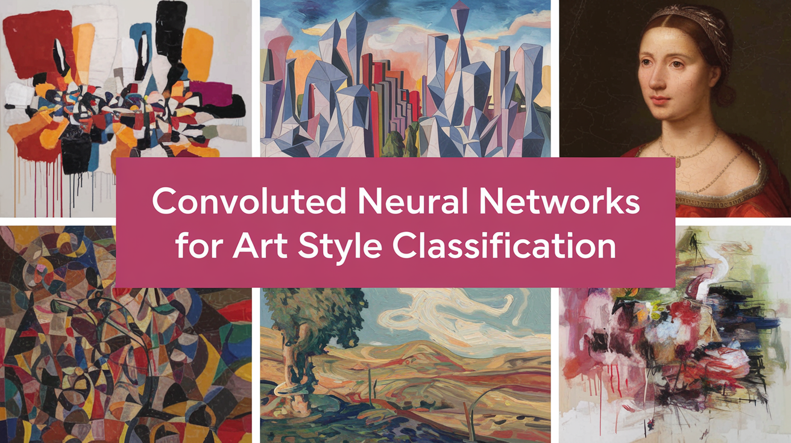

# Art Style Classifier



## Overview
The Art Style Classifier is a Streamlit web application that uses a Convolutional Neural Network (CNN) model to classify the artistic style of uploaded images. The application is built using TensorFlow and ResNet50, and it leverages the WikiArts database for training. Users can upload an image, and the app will predict the artistic style from the following categories:
- Impressionism
- Realism
- Cubism
- Art Nouveau

## Features
- Classify uploaded images based on artistic style.
- Display predicted style probabilities in a bar chart.
- Show the top predicted style with confidence percentage.
- Load pre-trained CNN model for inference.

## Setup and Installation
To run the app locally, follow these steps:

1. **Clone the repository:**
   ```sh
   git clone https://github.com/yourusername/yourrepository.git
   cd yourrepository
   ```

2. **Install the required dependencies:**
   Create a virtual environment and activate it (optional but recommended):
   ```sh
   python3 -m venv env
   source env/bin/activate   # On Windows use `env\Scripts\activate`
   ```

   Install the dependencies:
   ```sh
   pip install -r requirements.txt
   ```

3. **Run the Streamlit app:**
   ```sh
   streamlit run app.py
   ```

## Dependencies
Make sure you have the following dependencies in your `requirements.txt` file:
```plaintext
streamlit==1.9.0
numpy==1.21.2
Pillow==8.3.2
pandas==1.3.3
requests==2.26.0
tensorflow==2.6.0
```

## How to Use
1. Open the app in your web browser after running the Streamlit app.
2. Upload an image by clicking on the "Choose an image..." button.
3. View the uploaded image and the predicted style probabilities.
4. Check the top predicted style and its confidence percentage.

## Code Explanation

### ArtStyleClassifier Class
This class handles the loading, training, and predicting functions of the CNN model.

- **`__init__(self, num_classes, selected_styles, image_size=(224, 224))`:**
  Initializes the classifier with specified parameters.

- **`_build_model(self)`:**
  Builds the ResNet50-based CNN model architecture.

- **`train(self, train_dataset, validation_dataset=None, epochs=10, initial_epoch=0)`:**
  Trains the model using the provided dataset.

- **`predict_single_image(self, image_path)`:**
  Predicts the style of a single uploaded image.

- **`predict_batch(self, dataset)`:**
  Predicts styles for a batch of images.

- **`save_model(self, path)`:**
  Saves the trained model to the specified path.

- **`load_weights(self, path)`:**
  Loads model weights from the specified path.

- **`load_model(cls, path, num_classes, selected_styles)`:**
  Loads the model from the specified path.

### App Implementation
- **Loading the Model:**
  The model is loaded using the `load_model()` function, which downloads the model file if it doesn't exist locally.

- **Main App Function:**
  The `main()` function sets up the Streamlit interface, handles file uploads, and displays predictions.

## Acknowledgments
- Built using [Streamlit](https://streamlit.io/)
- Model trained with [TensorFlow](https://www.tensorflow.org/)
- Image data from [WikiArts](https://www.wikiart.org/)

## License
This project is licensed under the MIT License. See the `LICENSE` file for details.

## Author
- [Sijana Mamos](https://github.com/yourusername)

Enjoy using the Art Style Classifier App! 🎨😊
